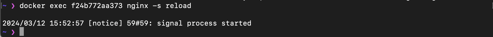
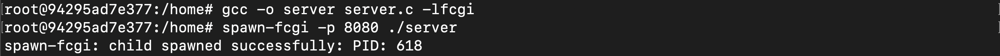
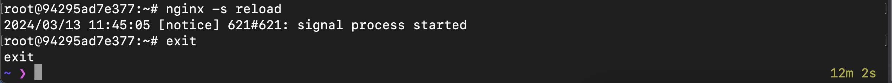

# Отчет о проделанной работе

## Цель работы
Целью данного проекта было изучение работы с Docker, контейнеризацией веб-сервера и основами работы с FastCGI. В ходе работы были выполнены задания по настройке и использованию Docker, созданию конфигурации для nginx, разработке собственного FastCGI-сервера и интеграции его в Docker-образ, а также сканированию контейнера на безопасность и развертыванию проекта через Docker Compose.

---

## Part 1. Готовый докер

1. Взял официальный докер-образ с **nginx** и скачал его при помощи ***docker pull nginx***.
    - ***docker pull*** - это команда, которая используется для загрузки образа ***Docker***.
    - ***nginx*** - это имя образа, который нужно загрузить.
    
2. Проверил наличие докер-образа через ***docker images***.

3. Запустил докер-образ через ***docker run -d [image_id|repository]***.
    - ***docker run*** - это команда, которая запускает новый контейнер ***Docker***.
    - ***-d*** : это флаг, который указывает ***Docker*** запустить контейнер в фоновом режиме (то есть контейнер будет работать в фоне, и можно продолжить использовать терминал для других команд)

4. Через команду ***docker ps*** проверил,что образ запустился.
***docker ps*** - используется для отображения списка работающих ***Docker*** контейнеров.

Вывод команды ***docker ps*** включает следующую информацию о каждом контейнере:
    - ***CONTAINER ID*** - уникальный идентификатор контейнера.
    - ***IMAGE*** - образ Docker, из которого был создан контейнер.
    - ***COMMAND*** - команда, которая была выполнена в контейнере при его запуске.
    - ***CREATED*** - когда контейнер был создан.
    - ***STATUS*** - текущий статус контейнера (например, “Up” (работает) или “Exited” (остановлен)).
    - ***PORTS*** - сетевые порты, которые открыты в контейнере.
    - ***NAMES*** - имя контейнера.
5. Через команду ***docker inspect [container_id|container_name]*** посмотрел информацию о контейнерах. По выводу команды определил список портов и ip контейнера.

    - Порт 80 контейнера открыт, но не привязан к порту хоста (обозначено как null).
    
    -  IP-адрес контейнера можно найти в разделе "IPAddress". В нашем случае, IP-адрес контейнера - 172.17.0.3.
    
    - Размер контейнера определил через ***docker ps -s*** команда используется для отображения списка работающих контейнеров с информацией о размере каждого контейнера.
    - Флаг ***-s*** добавляет информацию о размере файлов каждого контейнера.
    
        - ***“size”*** - это количество данных (на диске), которые используются для записываемого слоя каждого контейнера.
        - ***“virtual size”*** - это общее количество дискового пространства, используемого для данных образа только для чтения, используемых контейнером, и записываемого слоя.
6. Остановил докер образ через `docker stop [container_id|container_name]`. Проверил, что образ остановился через ***docker ps***.
    
7. Запустил докер с портами **80** и **443** в контейнере, замапленными на такие же порты на локальной машине, через команду ***docker run -d -p 80:80 -p 443:443 nginx***.
    - ***-d*** - это флаг, который указывает ***Docker*** запустить контейнер в фоновом режиме (то есть контейнер будет работать в фоне, и можно продолжить использовать терминал для других команд)
    - ***-p 80:80 -p 443:443*** - эти флаги используются для проброса портов. **80:80** означает, что порт **80** на хост-машине будет перенаправлен на порт **80** в контейнере. Аналогично, **443:443** означает, что порт **443** на хост-машине будет перенаправлен на порт **443** в контейнере. Это позволяет вам обращаться к службам в контейнере, как если бы они работали непосредственно на хост-машине.
    - ***nginx*** - это имя образа Docker, который будет использоваться для создания контейнера.
    
8. Проверил, что в браузере по адресу ***localhost:80*** доступна стартовая страница **nginx**.

9. Перезапустил докер контейнер через `docker restart [container_id|container_name]`. Проверил, что  контейнер запустился через ***docker ps***.

## Part 2. Операции с контейнером

1. Прочитал конфигурационный файл *nginx.conf* внутри докер контейнера через команду ***docker exec <container_id> cat /etc/nginx/nginx.conf***.
    - 
    - ***docker exec*** - это команда, которая позволяет выполнить новую команду в уже запущенном контейнере.
    - ***<container_id>*** - это идентификатор контейнера, в котором вы хотите выполнить команду.
    - ***cat*** /etc/nginx/nginx.conf - это стандартная Unix-команда, которая выводит содержимое файла /etc/nginx/nginx.conf - это путь к файлу конфигурации Nginx в контейнере.
2. Создал на локальной машине файл ***nginx.conf*** и настроил в нем по пути ***/status*** отдачу страницы статуса сервера **nginx**.

    - ***server { ... }*** : Этот блок определяет новый сервер или виртуальный хост в Nginx. Все директивы внутри этого блока применяются к этому серверу.
    - ***listen 80;*** : Эта директива указывает Nginx слушать входящие соединения на порту 80. Это стандартный порт для HTTP.
    - ***location /status { ... }*** : Этот блок определяет конфигурацию для запросов, которые соответствуют пути /***status***. Все директивы внутри этого блока применяются только к этому пути.
    - ***stub_status on;*** : Эта директива включает модуль ***stub_status*** Nginx. Этот модуль предоставляет информацию о состоянии сервера.
3. Скопировал созданный файл ***nginx.conf*** внутрь докер-образа через команду `docker cp`.

    - ***docker cp*** - это команда, которая копирует файлы и папки между контейнером и хост-системой.    
    - ***nginx.conf*** - это путь к файлу на хост-системе, который нужно скопировать.
    - ***f24b772aa373*** - это идентификатор контейнера, в который нужно вставить скопированный файл.
4. Перезапустил ***nginx*** внутри докер-образа через команду ***docker exec***.

    - ***docker exec*** - это команда, которая позволяет выполнить новую команду в уже запущенном контейнере.
    - ***f24b772aa373*** - это идентификатор контейнера, в которой нужно выполнить команду.
    - ***nginx -s reload*** - это команда, которую хотим выполнить в контейнере. Эта команда говорит Nginx перезагрузить его конфигурацию.
5. Проверил, что по адресу ***localhost:80/status*** отдается страничка со статусом сервера nginx.

6. Экспортируем контейнер в файл ***container.tar*** через команду ***docker export***.

7. Остановил контейнер через команду ***docker stop***.

8. Удалил образ через `docker rmi [image_id|repository]`, не удаляя перед этим контейнеры.

    - ***docker rmi*** - это команда, которая удаляет один или несколько Docker образов.
    - ***-f*** : это флаг, который указывает Docker принудительно удалить указанный образ.
9. Удалил остановленный контейнер через ***docker rm***.

10. Импортировал контейнер обратно через команду `docker import`.

    - Команда ***docker import*** используется для импорта содержимого тарбола (.tar файла) и создания файловой системы образа Docker. В данном случае, импортируем файл container.tar и создаем образ с именем nginx.
    - ***-c*** : позволяет нам указать конфигурацию Docker в формате JSON. В данном случае, мы указываем команду CMD ["nginx", "-g", "daemon off;"], которая будет выполняться при запуске контейнера из этого образа.
11. Запускаем импортированный контейнер через команду ***docker run***.

    - ***-d*** : это флаг, который указывает Docker запустить контейнер в фоновом режиме (то есть контейнер будет работать в фоне, и можно продолжить использовать терминал для других команд)
    - ***-p 80:80*** - эти флаги используются для проброса портов. ***80:80*** означает, что порт ***80*** на хост-машине будет перенаправлен на порт ***80*** в контейнере. Это позволяет вам обращаться к службам в контейнере, как если бы они работали непосредственно на хост-машине.
12. Проверил, что по адресу ***localhost:80/status*** отдается страничка со статусом сервера **nginx**.

## Part 3. Мини веб-сервер

1. Написал мини-сервер на **С** и **FastCgi**, который будет возвращать простейшую страничку с надписью ***Hello World!***.

2. Написал свой ***nginx.conf***, который будет проксировать все запросы с ***81*** порта на ***127.0.0.1:8080***.

3. Запустил докер с портом 81, через команду ***docker run -d -p 81:81 nginx***

    - ***-d*** - это флаг, который указывает ***Docker*** запустить контейнер в фоновом режиме (то есть контейнер будет работать в фоне, и можно продолжить использовать терминал для других команд)
    - ***-p 81:81*** - эти флаги используются для проброса портов. ***81:81*** означает, что порт ***81*** на хост-машине будет перенаправлен на порт ***81*** в контейнере.
4. Скопировал созданный файл ***nginx.conf*** и ***server.c*** внутрь докер-образа через команду ***docker cp***.

    - ***docker cp*** - это команда, которая копирует файлы и папки между контейнером и хост-системой.
    - ***nginx.conf*** - это путь к файлу на хост-системе, который нужно скопировать.
    - ***server.c*** - это мини-сервер на **Си** и  **FastCgi**.
    - ***gallant_hofstadter*** - это идентификатор контейнера, в который нужно вставить скопированный файл.
5. Переключаемся на контейнер командой ***docker exec -it gallant_hofstadter bash*** и также обновляем список доступных пакетов и их версий их репозиториев. 

    - ***docker exec*** : команда Docker для выполнения команды в запущенном контейнере.
    - ***-it*** : флаг -i гарантирует, что STDIN открыт, что позволяет взаимодействовать с оболочкой bash, а флаг -t выделяет псевдо-TTY, что делает его похожим на обычный терминал.
    - ***gallant_hofstadter*** : это имя Docker контейнера, в котором хотим запустить оболочку bash.
    - ***bash*** : это команда, которую вы хотите выполнить в контейнере. В данном случае мы запускаем оболочку bash.
6. Установливаем необходимые утилиты для работы мини веб-сервера на FastCGI, в частности ***spawn-fcgi*** и ***libfcgi-dev***

    - ***gcc*** - компилятор С.
    - ***spawn-fcgi*** - для запуска FastCGI-приложений.
    - ***libfcgi-dev*** - библиотека для разработки FastCGI-приложений.
7. Скомпилируем и запустим мини-сервер через ***spawn-fcgi*** на порту 8080. 

8. Перезапустил файл ***nginx.conf*** через команду ***nginx -s reload***.

    - ***nginx***: Это основная команда для запуска и управления веб-сервером Nginx.
    - ***-s reload***: Флаг -s используется для отправки сигнала к процессу Nginx. В данном случае, сигнал ***reload*** приводит к перезагрузке конфигурации Nginx без остановки основного процесса.
9. Проверил, что в браузере по ***localhost:81*** отдается написанная мной страничка.

## Part 4. Свой докер

1. Написал свой докер образ,который собирает исходники мини сервера на FastCgi из [Части 3](#part-3-мини-веб-сервер). Запускает его на ***8080*** порту. Копирует внутрь образа написанный ***./nginx/nginx.conf*** и запускает ***nginx***.

    - ***FROM nginx***: Эта команда начинает новый этап с образа nginx в качестве базового. ***nginx*** - это популярный веб-сервер.
    - ***WORKDIR /home/***: Эта команда устанавливает рабочий каталог внутри контейнера на ***/home/***.
    - ***COPY ./nginx.conf /etc/nginx/nginx.conf***: Эта команда копирует файл nginx.conf из локального контекста сборки в ***/etc/nginx/nginx.conf*** внутри контейнера.
    - ***COPY ./server.c . и COPY ./start.sh*** .: Эти команды копируют файлы server.c и start.sh из локального контекста сборки в текущий рабочий каталог внутри контейнера.
    - ***RUN apt-get update***: Эта команда обновляет список пакетов внутри контейнера.
    - ***RUN apt-get install -y gcc spawn-fcgi libfcgi-dev***: Эта команда устанавливает пакеты ***gcc, spawn-fcgi*** и ***libfcgi-dev*** внутри контейнера.
    - ***ENTRYPOINT ["sh", "./start.sh"]***: Эта команда устанавливает скрипт ***start.sh*** в качестве точки входа контейнера, который будет выполняться при запуске контейнера.

2. Собрал написанный докер-образ через `docker build` при этом указал имя: ***haki_lucky*** и тег: ***latest***.

    - ***docker build***: Это основная команда Docker для создания Docker-образов. Она считывает Dockerfile из текущего каталога (указанного точкой . в конце команды).
    - ***t***: Флаг используется для установки тега образу. - ***haki_lucky*** - это имя образа.
    - ***latest*** - это тег образа. Если тег не указан, по умолчанию используется тег latest.
3. Проверил через ***docker images***, что все собралось корректно.

4. Запустил собранный докер-образ с маппингом ***81*** порта на ***80*** на локальной машине и маппингом папки ***./nginx*** внутрь контейнера по адресу, где лежат конфигурационные файлы ***nginx***'а (см. [Часть 2](#part-2-операции-с-контейнером)).

    - ***docker run***: Это основная команда Docker для запуска контейнеров. Она создает новый контейнер и запускает его.
    - ***-it***: Эти флаги используются для запуска контейнера в интерактивном режиме с подключенным терминалом.
    - ***-p 80:81***: Этот флаг используется для проброса портов. Он пробрасывает порт ***81*** внутри контейнера на порт 80 хост-системы.
    ***-v /Users/hakearie/DO5_SimpleDocker-1/src/part4/nginx.conf:/etc/nginx/nginx.conf***: Этот флаг используется для монтирования томов. Он монтирует файл nginx.conf из хост-системы в ***/etc/nginx/nginx.conf*** внутри контейнера.
    - ***-d***: Этот флаг используется для запуска контейнера в фоновом режиме.
    - ***haki_lucky:latest***: Это имя и тег образа Docker, который будет использоваться для создания контейнера.
    - ***bash***: Это команда, которая будет выполнена внутри контейнера после его запуска.

5. Проверил, что по ***localhost:80*** доступна страничка написанного мини сервера.

6. Дописал в ***./nginx/nginx.conf*** проксирование странички ***/status***, по которой надо отдавать статус сервера ***nginx***.

7. Перезапустил докер-образ.

    - ***nginx***: Это основная команда для запуска и управления веб-сервером Nginx.
    - ***-s reload***: Флаг -s используется для отправки сигнала к процессу Nginx. В данном случае, сигнал ***reload*** приводит к перезагрузке конфигурации Nginx без остановки основного процесса.
8. Проверил, что теперь по ***localhost:80/status*** отдается страничка со статусом ***nginx***.

## Part 5. **Dockle**

1. Просканировал образ из предыдущего задания через `dockle [image_id|repository]`.

2. Исправил образ так, чтобы при проверке через ***dockle*** не было ошибок и предупреждений.

    - В Dockerfile были сделаны следующие изменения по сравнению с Dockerfile из [Части 4](#part-4-свой-докер) :
        - Все команды ***RUN*** были объединены в одну для оптимизации слоев Docker-образа.
        - Добавлены команды ***chmod*** для изменения прав доступа к некоторым системным файлам.
        - Добавлена команда ***rm -rf /var/lib/apt/lists*** для удаления файлов списка пакетов, что помогает уменьшить размер образа.
        - Добавлена команда ***USER nginx***, которая указывает Docker запускать последующие команды от имени пользователя nginx.
        - Добавлена команда ***HEALTHCHECK NONE***, которая отключает любые проверки состояния по умолчанию, которые могут быть настроены в родительском образе.
3. Cобираем новый контейнер и проверяем, чтобы через утилиту ***dockle*** не возникало ошибок и предупреждений.

## Part 6. Базовый **Docker Compose**

1. Написал файл ***docker-compose.yml***.

2. Изменил nginx.conf файлы для первого и второго контейнера. 
    - Конфигурационный файл 1-го контейнера: для докер-контейнера с **nginx**, который будет проксировать все запросы с 8080 порта на 81 порт первого контейнера.

    - Конфигурационный файл 2-го контейнера: 

3. Остановил все запущенные контейнеры и проверил нет ли запущенных контейнеров.

4. Собрал и запустил проект с помощью команд `docker-compose build` и `docker-compose up`.

5. Проверил, что контейнеры действительно запустились.

6. Проверил, что в браузере по ***localhost:80*** отдается страничка с надписью ***Hello World!***.

---

## Вывод
В ходе выполнения проекта я:
- Ознакомился с основами работы с Docker и контейнерами.
- Освоил создание и настройку nginx внутри контейнера.
- Разработал FastCGI-сервер и интегрировал его в Docker-образ.
- Провел анализ безопасности контейнера.
- Развернул многоконтейнерный проект с помощью docker-compose.

Полученные навыки пригодятся в DevOps, системном администрировании и разработке контейнеризированных приложений.